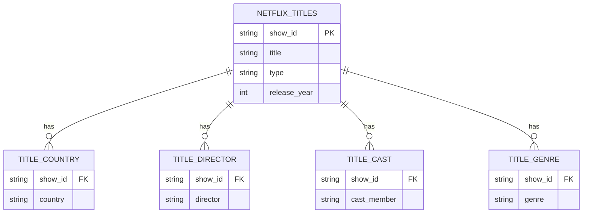

# SQL queries on Netflix catalogue
Looking at the Netflix catalogue database, reporting features for each show present, we want to retrieve and find peculiar patterns, such as geographic production, difference between movies and TV shows, contribution by multiple actors, genres and temporal evolution.

## Point 0 - database inspection

A first major issue in the database as it is the listing of multiple items in the same cell, happening for the variables director, cast, country and listed_in. This does not allow to properly apply functions (f.i. COUNT) to the values, therefore requiring a re-modeling. In particular, in order to perform the fragmentation of such items operating on strings, the proposal refers to use Python to create one different database for each of those problematic variables, each duplicating the rows of a show_id for eventual multiple items of the variable. In this way, the original database is simplified and there are supportive databases for which the show_id is the key to the original one with important additional information (f.i. the title, which is, in opposite to show_id, not comfortable for calculation but essential for output interpretation).

An example of the new tables is given here:

It is worth to be noted that from a formal point of view the four new sub-tables are constituted by a compund primary key, incliuding both the show_id and the other reference variable.

## Point 1 - Content production across countries

### Which countries produce more contents? 
- Now that we start writing queries, please not that the presence of NULL values in the original database is accounted for in those queries by including a WHERE and IS NOT NULL clause)
- Additionally, for clearer reporting purposes, a new column is added to the output based on the result to communicate if we're facing a single-country or multi-country production - see the result, we could simpler and better set low-medium-high based on interval (if more than 95% of the countries are multi the first classification is not so informative; could even download the result, plot the distribution and define the thresholds accordingly

### Does the result changes if we carry out a different process for Movies and TV shows?

### Production map
Using the two tables from the previous point could plot in Python a matrix in which plot each country according to production in Movies and TV shows, and optimisticallyt cluster them for the final insight

## Point 2 - Temporal evolution of short vs long contents
There are several studies that indicates how with years passing and evolution of the pace of life, digitalization and social media the attention threshold of people has decreased.

- Interesting to inspect if the production release schedule of Netflix over years is coherent with such a trend, and in general understand if one type of content is preferred/more easily produced and so on (# of movies and TV shows for release year, or #titles released each year (absolute) + % movies over the total to be more synthetic)

- Focusing on Movies only (assumptions that you do not know if the number of seasons of a TV shows is ended or in process, so not reliable measure of duration), repeat the analysis by finding for each year aggregated measures related to duration

## Point 3 - Genres representation

- similar to country analysis, you can intersect the result with the type (movie or tv-shows): objective of understanding tendencies

  
